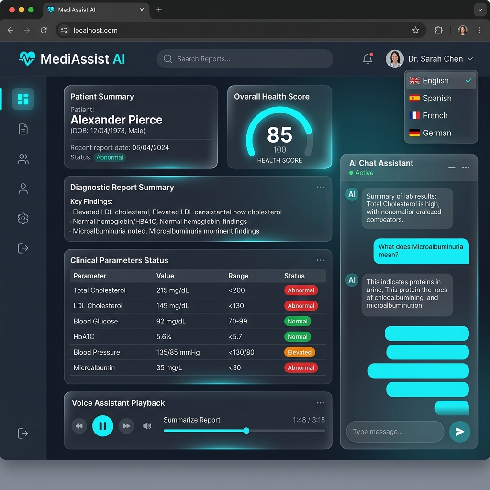
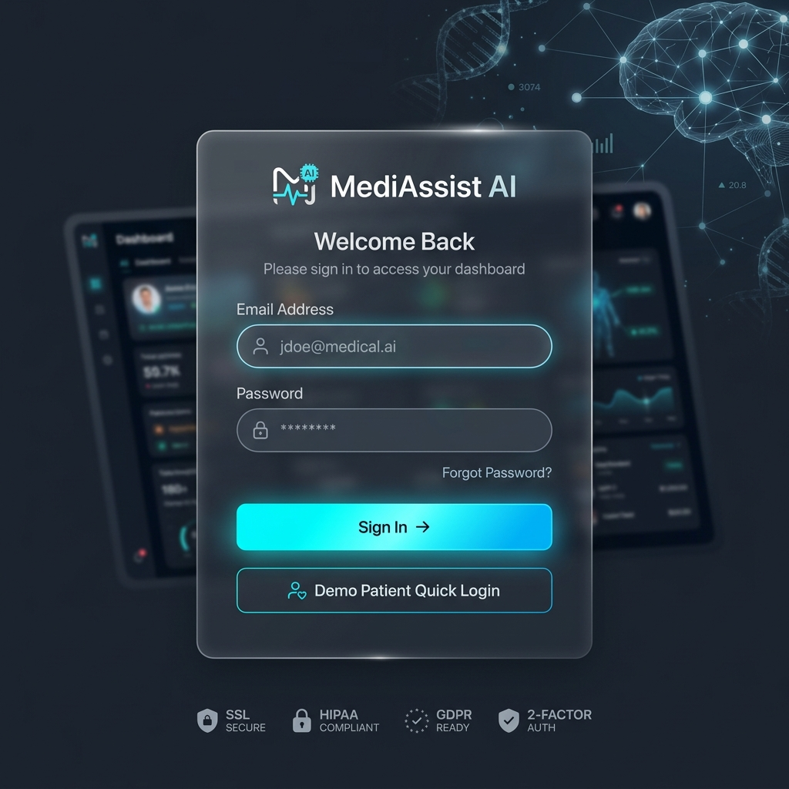

# MediAssist AI 🩺💬

> **Multilingual Medical Report Summarizer, Voice Health Assistant & Grounded RAG Chat**

---

## 🖼️ Application Interface Previews

### 1. Medical Report Summary Dashboard


### 2. User Authentication & Login Screen


---

MediAssist AI is a full-stack production-ready web application designed to parse complex diagnostic PDF medical reports (Blood Tests, CBC, MRI Scans, CT Scans, X-Rays, ECGs, Pathology) into plain-language summaries, clinical health insights, spoken audio narrations, and interactive multilingual voice/text chat grounded in patient report context.

---

## 🌟 Key Features

- **📑 PDF Medical Report Extraction & Pydantic Schema Parsing**: Automatic PDF text extraction (PyMuPDF) followed by strict LLM JSON extraction adhering to validated medical schemas.
- **🌍 8 Languages Multilingual Support**: Instant report translation into English, Hindi (हिंदी), Kannada (ಕನ್ನಡ), Tamil (தமிழ்), Telugu (తెలుగు), Malayalam (മലയാളം), Marathi (मराठी), and Bengali (বাংলা) with database translation caching.
- **🔊 Voice Assistant (Text-to-Speech)**: Audio narration controls (Play, Pause, Speed, Replay) powered by OpenAI TTS API with browser Web Speech API fallbacks.
- **🎤 Real Microphone Voice Chat**: Integrated Web MediaRecorder audio recording sent directly to OpenAI Whisper API for speech-to-text, processed via RAG chat, and spoken back as audio replies.
- **🧠 Grounded RAG Chat Engine**: Per-report document chunking and vector storage (LangChain + ChromaDB) allowing patients to ask report-specific follow-up questions.
- **📊 Clinical Health Insights Dashboard**: Health Score radial indicator (0-100), Risk Evaluation (Low, Moderate, High), abnormal parameter red-badge highlights, suggested follow-up tests, and questions for your doctor.
- **💾 Real File Exports**: One-click downloads for formatted printable PDF summaries (ReportLab), spoken MP3 audio summaries, and raw structured Pydantic JSON reports.
- **🛡️ Embedded Medical Disclaimer**: Visible disclaimer on UI footers and attached to all AI-generated outputs.

---

## 🏗️ Architecture & Tech Stack

```
                               ┌───────────────────────────────────┐
                               │       React Vite Frontend         │
                               │   (Tailwind CSS, Lucide Icons)    │
                               └─────────────────┬─────────────────┘
                                                 │ (Single Proxy / Port 80)
                               ┌─────────────────▼─────────────────┐
                               │       Nginx Reverse Proxy         │
                               └─────────────────┬─────────────────┘
                                                 │
                               ┌─────────────────▼─────────────────┐
                               │        FastAPI Python Backend     │
                               └────────┬────────┬────────┬────────┘
                                        │        │        │
               ┌────────────────────────┘        │        └────────────────────────┐
               ▼                                 ▼                                 ▼
┌───────────────────────────┐     ┌───────────────────────────┐     ┌───────────────────────────┐
│ PostgreSQL / SQLite DB    │     │  ChromaDB Vector Store    │     │   OpenAI API Client       │
│ (Users, Reports, Insights)│     │  (LangChain RAG Chunks)   │     │ (GPT-4o-mini,Whisper,TTS) │
└───────────────────────────┘     └───────────────────────────┘     └───────────────────────────┘
```

- **Frontend**: React 19, Vite, Tailwind CSS, Lucide Icons, Axios, React Router.
- **Backend**: Python 3.10+, FastAPI, SQLAlchemy, Pydantic, PyMuPDF, ReportLab, deep-translator.
- **Database**: PostgreSQL (Production) / SQLite (Local fallback).
- **AI & Speech Layer**: OpenAI API (`gpt-4o-mini`, `whisper-1`, `tts-1`), LangChain, ChromaDB.
- **Orchestration**: Docker & Docker Compose behind Nginx reverse proxy.

---

## 📁 Project Directory Structure

```text
medAIAssist/
├── backend/
│   ├── app/
│   │   ├── auth.py             # JWT authentication & password hashing
│   │   ├── config.py           # Environment variables configuration
│   │   ├── database.py         # SQLAlchemy engine & session setup
│   │   ├── llm_client.py       # OpenAI LLM / Whisper STT / TTS wrapper
│   │   ├── main.py             # FastAPI routes & static file server
│   │   ├── models.py           # Database entities (User, Report, Chat, etc.)
│   │   ├── parser.py           # PyMuPDF PDF extraction & JSON parsing
│   │   ├── pdf_generator.py    # ReportLab PDF report builder
│   │   ├── rag.py              # LangChain + ChromaDB vector indexer
│   │   ├── schemas.py          # Pydantic validation schemas
│   │   └── translator.py       # Multilingual translation engine
│   ├── Dockerfile
│   ├── requirements.txt
│   └── run.py                  # Server launcher (uvicorn)
├── frontend/
│   ├── src/
│   │   ├── components/         # Navbar, Footer, UploadModal
│   │   ├── context/            # AuthContext (JWT state)
│   │   ├── pages/              # LoginPage, DashboardPage, ReportDetailPage
│   │   ├── App.jsx             # Main router configuration
│   │   └── main.jsx
│   ├── Dockerfile
│   ├── nginx.conf              # Nginx proxy configuration
│   └── package.json
├── docker-compose.yml          # Multi-container orchestration setup
├── smoke_test.py               # End-to-end automated sanity test script
├── .env.example                # Sample environment variables
└── README.md
```

---

## 🚀 Quick Start Guide

### 1. Environment Configuration

Create a `.env` file in the root directory (or use default fallback values):

```env
DATABASE_URL=sqlite:///./mediassist.db
JWT_SECRET=mediassist_super_secret_key_98765
OPENAI_API_KEY=your_openai_api_key_here
LLM_MODEL=gpt-4o-mini
TTS_MODEL=tts-1
STT_MODEL=whisper-1
```

### 2. Backend Local Setup

```bash
cd backend
python -m venv venv
.\venv\Scripts\activate      # Windows (or source venv/bin/activate on Linux)
pip install -r requirements.txt
python run.py
```
*Backend listens at `http://127.0.0.1:8080`*

### 3. Frontend Local Setup

```bash
cd frontend
npm install
npm run dev
```
*Frontend dev server runs at `http://localhost:5173` (automatically proxies `/api` to port 8080)*

---

## 🧪 Automated End-to-End Smoke Test

Run the standalone verification script to test registration, login, PDF upload, structured JSON parsing, translation, TTS audio generation, RAG chat, microphone voice chat, health insights, and file downloads:

```bash
python smoke_test.py
```

---

## 🐳 Docker Deployment

To launch the full stack (PostgreSQL, ChromaDB, FastAPI Backend, React Frontend + Nginx Proxy) on **port 80**:

```bash
docker compose up -d --build
```
*Access the application at **`http://localhost`***

---

## 🔌 API Contract Reference

| Method | Endpoint | Description |
| :--- | :--- | :--- |
| `POST` | `/api/auth/register` | User registration |
| `POST` | `/api/auth/login` | User login (returns JWT token) |
| `GET` | `/api/auth/me` | Retrieve authenticated user profile |
| `POST` | `/api/reports/upload` | Upload PDF report & run parsing pipeline |
| `GET` | `/api/reports` | List user's medical reports |
| `GET` | `/api/reports/{id}` | Get structured report summary |
| `POST` | `/api/reports/{id}/translate` | Translate report (`language`) |
| `POST` | `/api/reports/{id}/tts` | Synthesize speech audio stream |
| `POST` | `/api/reports/{id}/chat` | Grounded RAG QA chat |
| `POST` | `/api/reports/{id}/voice-chat` | Voice audio input $\rightarrow$ STT $\rightarrow$ Chat $\rightarrow$ Audio reply |
| `GET` | `/api/reports/{id}/insights` | Health score & clinical metrics |
| `GET` | `/api/reports/{id}/download/pdf` | Download formatted PDF report |
| `GET` | `/api/reports/{id}/download/audio` | Download MP3 spoken audio |
| `GET` | `/api/reports/{id}/download/json` | Download raw structured JSON |

---

## 🔄 Swapping LLM / Speech Providers

All AI calls pass through `backend/app/llm_client.py`:
- To change the OpenAI model: set `LLM_MODEL=gpt-4o` or `LLM_MODEL=gpt-3.5-turbo` in `.env`.
- To swap to an alternative provider (e.g., Anthropic, Ollama, Google Gemini): modify the completion handler inside `backend/app/llm_client.py`.

---

## ⚠️ Medical Disclaimer

*MediAssist AI provides educational information only and is not a substitute for professional medical advice, diagnosis, or treatment. Always consult a qualified doctor or healthcare provider with any questions regarding a medical condition.*
